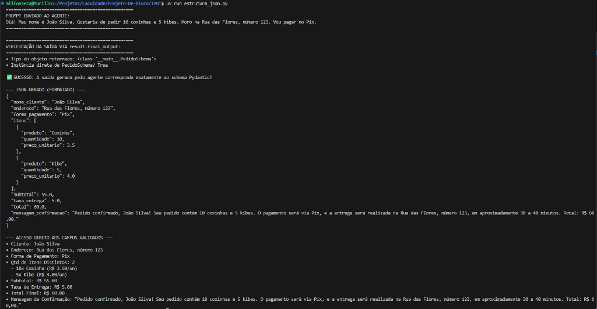
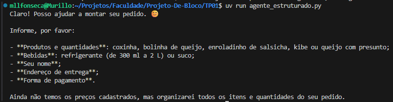
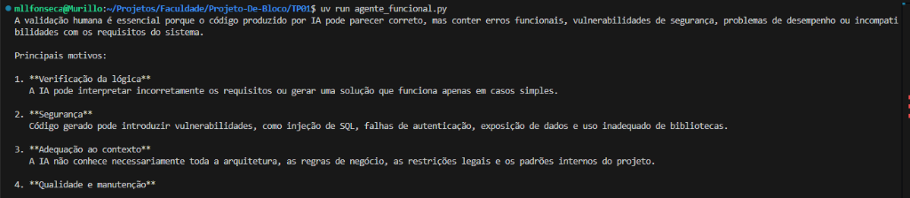

# Evidências de Execução

Documentação visual das execuções dos scripts do projeto.

---

### 1. Estrutura JSON (`estrutura_json.py`)
Demonstração da validação da saída gerada pelo agente utilizando Pydantic/JSON.

- **Link para a imagem:** [estrutura_json.png](./estrutura_json.png)

---

### 2. Agente Estruturado (`agente_estruturado.py`)
Demonstração do agente interagindo e solicitando as informações necessárias para montagem do pedido.

- **Link para a imagem:** [agente_estruturado.png](./agente_estruturado.png)

---

### 3. Agente Funcional (`agente_funcional.py`)
Demonstração da resposta sobre a importância da validação humana sobre o código gerado por IA.

- **Link para a imagem:** [agente_funcional.png](./agente_funcional.png)

