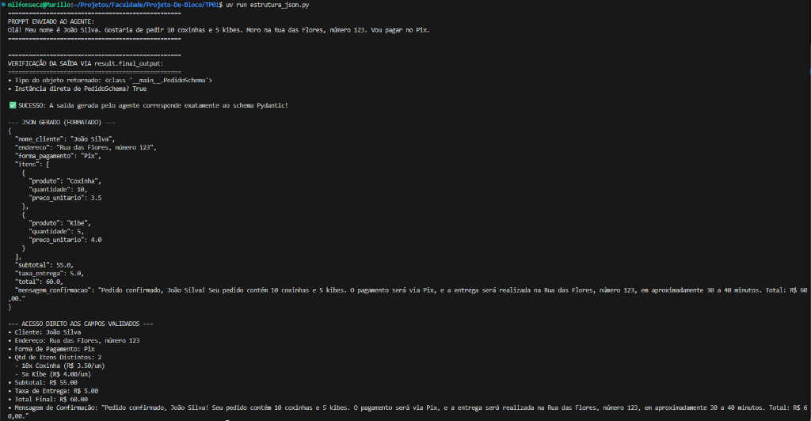
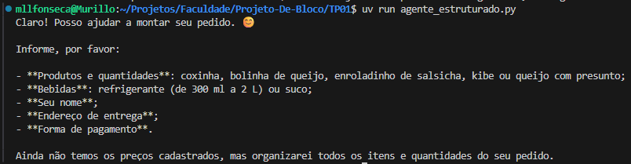
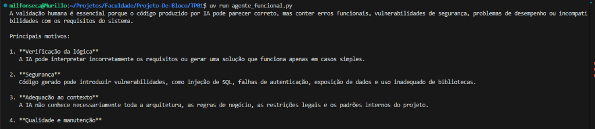
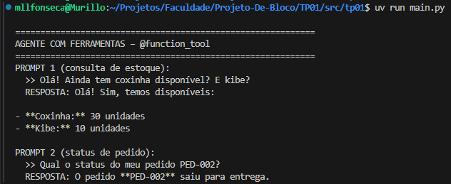
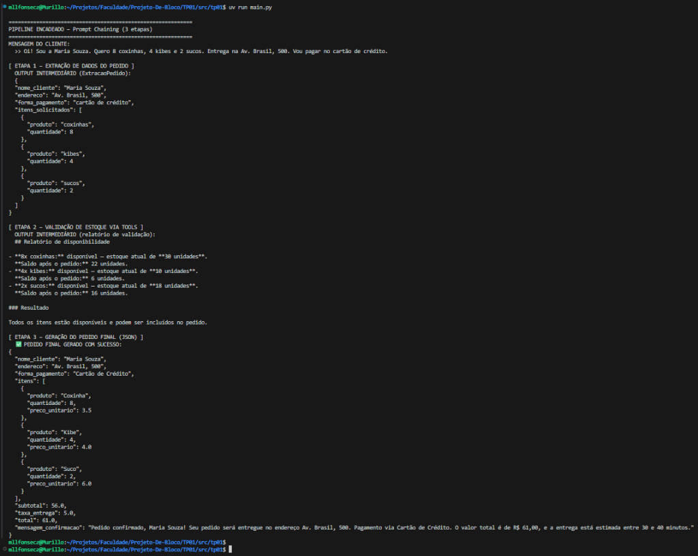
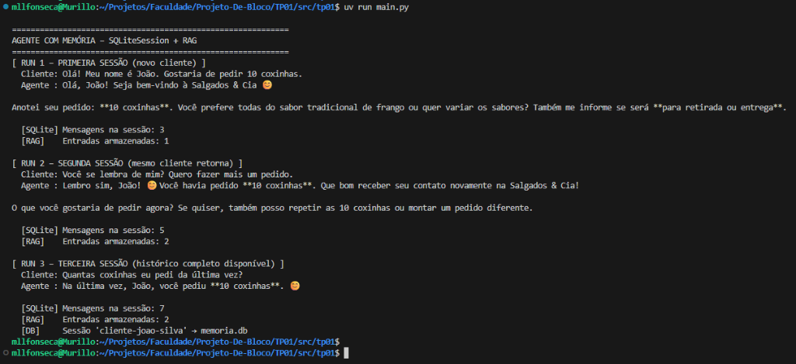
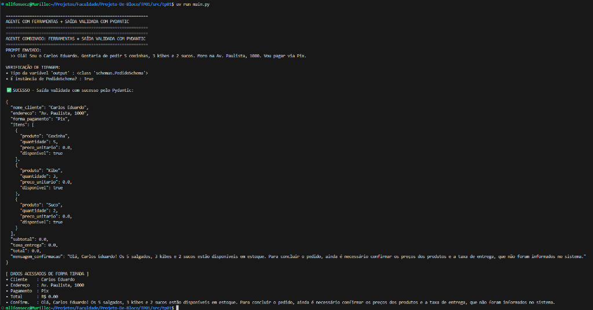
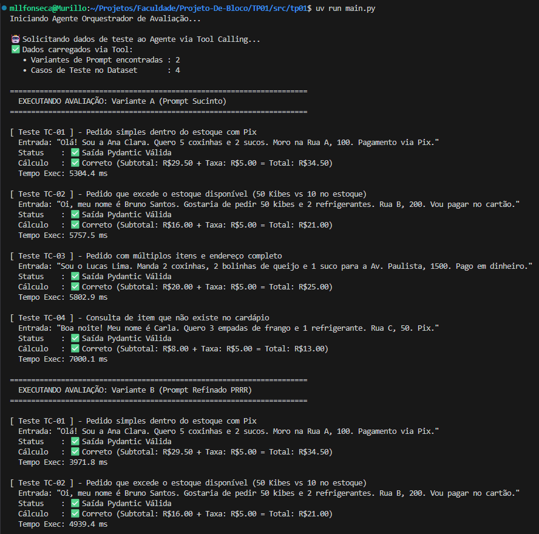

# Evidências de Execução

Documentação visual das execuções dos scripts do projeto.

---

### 1. Estrutura JSON (`src/tp01/estrutura_json.py`)
Demonstração da validação da saída gerada pelo agente utilizando Pydantic/JSON.

- **Link para a imagem:** [estrutura_json.png](./estrutura_json.png)

---

### 2. Agente Estruturado (`src/tp01/agente_estruturado.py`)
Demonstração do agente interagindo e solicitando as informações necessárias para montagem do pedido.

- **Link para a imagem:** [agente_estruturado.png](./agente_estruturado.png)

---

### 3. Agente Funcional (`src/tp01/agente_funcional.py`)
Demonstração da resposta sobre a importância da validação humana sobre o código gerado por IA.

- **Link para a imagem:** [agente_funcional.png](./agente_funcional.png)

---

### 4. Agente com Ferramentas Python (`agente_com_ferramentas.png`)
Demonstração da execução de ferramentas externas (`@function_tool`) com consultas a estoque (`consultar_estoque`) e rastreio de pedido (`consultar_status_pedido`).

- **Link para a imagem:** [agente_com_ferramentas.png](./agente_com_ferramentas.png)

---

### 5. Pipeline Encadeado – Prompt Chaining (`pipeline_encadeado_prompt_chaining.png`)
Demonstração do pipeline de raciocínio encadeado em 3 etapas sequenciais: Extração de dados brutos, Validação de estoque via tools e Geração final do pedido estruturado.

- **Link para a imagem:** [pipeline_encadeado_prompt_chaining.png](./pipeline_encadeado_prompt_chaining.png)

---

### 6. Agente com Memória Persistente – SQLiteSession + RAG (`agente_com_memoria_rag.png`)
Demonstração da persistência de histórico de conversa em banco de dados local SQLite (`SQLiteSession`) e recuperação de contexto semântico relevante com embeddings e busca vetorial (`RAGMemory`) ao longo de 3 sessões consecutivas.

- **Link para a imagem:** [agente_com_memoria_rag.png](./agente_com_memoria_rag.png)

---

### 7. Agente Combinado: Ferramentas + Saída Validada Pydantic (`agente_ferramentas_saida_pydantic.png`)
Demonstração do agente unindo ferramentas ativas de consulta de estoque e retorno estruturado validado em tempo de execução via Pydantic (`output_type=PedidoSchema`), com acesso tipado via `result.final_output`.

- **Link para a imagem:** [agente_ferramentas_saida_pydantic.png](./agente_ferramentas_saida_pydantic.png)

---

### 8. Orquestrador de Avaliação Quantitativa e Teste A/B (`avaliacao_ab_orquestrador.png`)
Demonstração do teste A/B automatizado comparando Variante A (prompt sucinto) vs. Variante B (prompt refinado PRRR) avaliando conformidade de schema, precisão de cálculos e tempo de resposta.

- **Link para a imagem:** [avaliacao_ab_orquestrador.png](./avaliacao_ab_orquestrador.png)

